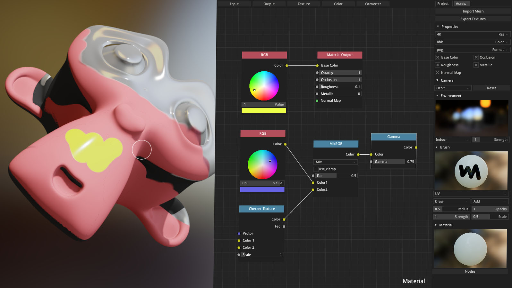

armorpaint
==============

[Manual](http://armorpaint.org/manual/) - [Forums](http://forums.armory3d.org)

ArmorPaint is a tool for 3D PBR texture painting. Powered by [Armory](http://armory3d.org).

Note: If you are compiling git version of ArmorPaint then you need to use git version of Armory as well.
